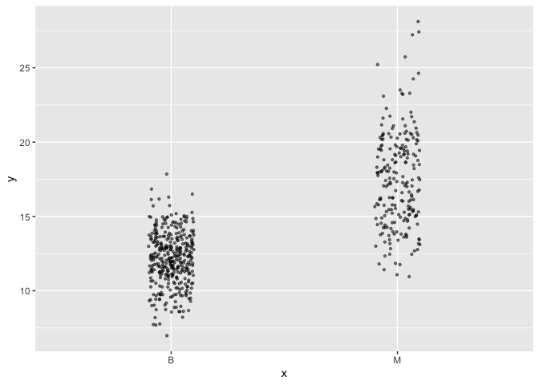
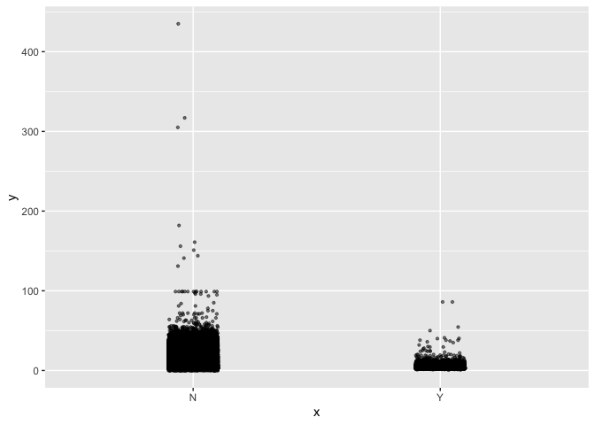
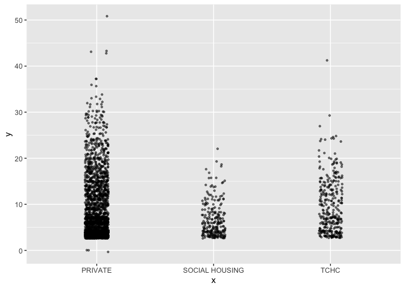

Assignment b1
================
2023-11-03

# Initial Steps

First, we need to load our dataset and the necessary packagse.

``` r
library(datateachr) # contains data that will be used for the assignment
library(tidyverse) #includes the dplyr package for data processing and handling
```

    ## ── Attaching core tidyverse packages ──────────────────────── tidyverse 2.0.0 ──
    ## ✔ dplyr     1.1.3     ✔ readr     2.1.4
    ## ✔ forcats   1.0.0     ✔ stringr   1.5.0
    ## ✔ ggplot2   3.4.3     ✔ tibble    3.2.1
    ## ✔ lubridate 1.9.2     ✔ tidyr     1.3.0
    ## ✔ purrr     1.0.2     
    ## ── Conflicts ────────────────────────────────────────── tidyverse_conflicts() ──
    ## ✖ dplyr::filter() masks stats::filter()
    ## ✖ dplyr::lag()    masks stats::lag()
    ## ℹ Use the conflicted package (<http://conflicted.r-lib.org/>) to force all conflicts to become errors

``` r
library(ggplot2)
library (testthat)
```

    ## 
    ## Attaching package: 'testthat'
    ## 
    ## The following object is masked from 'package:dplyr':
    ## 
    ##     matches
    ## 
    ## The following object is masked from 'package:purrr':
    ## 
    ##     is_null
    ## 
    ## The following objects are masked from 'package:readr':
    ## 
    ##     edition_get, local_edition
    ## 
    ## The following object is masked from 'package:tidyr':
    ## 
    ##     matches

# Exercise 1: Make a Function

I chose to make a function for a plot that I used frequently for
STAT545A Mini Data Analysis Project. This function creates a jitter plot
looking at the relationship between two variables within the dataset.
One variable is categorical and the other is numeric.

``` r
jitterplot <- function(x, y) {
  if (!(is.character(x))){
    stop('You have not indicated a categorical variable')
  }
  if(!(is.numeric(y))) {
    stop('You have not indicated a numeric variable.')
  }
  ggplot(mapping = aes(x, y)) + 
  geom_jitter(size = 0.8, alpha = 0.5, width = 0.1) 
}
```

# Exercise 2: Document your Function

``` r
jitterplot <- function(x, y) {
  if (!(is.character(x))){
    stop('You have not indicated a categorical variable')
  }
  if(!(is.numeric(y))) {
    stop('You have not indicated a numeric variable.')
  }
  ggplot(mapping = aes(x, y)) + 
  geom_jitter(size = 0.8, alpha = 0.5, width = 0.1) 
}

#'@Jitterplot 
#'@description This function can be used to create a jitter plot to look at the relationship between two variables, one categorical and one numeric. The data points are of size 0.8 with alpha transparency and a set width of 0.1 so the points don't jitter too far away from one another.
#'@param x A categorical variable in the dataset, usually an independent variable.
#'@param y A numerical variable in the dataset, usually a dependent variable.
#'@return The ultimate plot that is seen is a jitter plot that shows each datapoint, using a categorical variable on the x axis and a numerical one on the y axis. This plot also allows the visualization of the mean of the numerical variable plotted.
```

# Exercise 3: Include Examples

Example 1: Plotting the relationship of the mean radius size of nuclei
depending on malignancy.

``` r
summary(cancer_sample) #shows me the variables in the dataset
```

    ##        ID             diagnosis          radius_mean      texture_mean  
    ##  Min.   :     8670   Length:569         Min.   : 6.981   Min.   : 9.71  
    ##  1st Qu.:   869218   Class :character   1st Qu.:11.700   1st Qu.:16.17  
    ##  Median :   906024   Mode  :character   Median :13.370   Median :18.84  
    ##  Mean   : 30371831                      Mean   :14.127   Mean   :19.29  
    ##  3rd Qu.:  8813129                      3rd Qu.:15.780   3rd Qu.:21.80  
    ##  Max.   :911320502                      Max.   :28.110   Max.   :39.28  
    ##  perimeter_mean     area_mean      smoothness_mean   compactness_mean 
    ##  Min.   : 43.79   Min.   : 143.5   Min.   :0.05263   Min.   :0.01938  
    ##  1st Qu.: 75.17   1st Qu.: 420.3   1st Qu.:0.08637   1st Qu.:0.06492  
    ##  Median : 86.24   Median : 551.1   Median :0.09587   Median :0.09263  
    ##  Mean   : 91.97   Mean   : 654.9   Mean   :0.09636   Mean   :0.10434  
    ##  3rd Qu.:104.10   3rd Qu.: 782.7   3rd Qu.:0.10530   3rd Qu.:0.13040  
    ##  Max.   :188.50   Max.   :2501.0   Max.   :0.16340   Max.   :0.34540  
    ##  concavity_mean    concave_points_mean symmetry_mean    fractal_dimension_mean
    ##  Min.   :0.00000   Min.   :0.00000     Min.   :0.1060   Min.   :0.04996       
    ##  1st Qu.:0.02956   1st Qu.:0.02031     1st Qu.:0.1619   1st Qu.:0.05770       
    ##  Median :0.06154   Median :0.03350     Median :0.1792   Median :0.06154       
    ##  Mean   :0.08880   Mean   :0.04892     Mean   :0.1812   Mean   :0.06280       
    ##  3rd Qu.:0.13070   3rd Qu.:0.07400     3rd Qu.:0.1957   3rd Qu.:0.06612       
    ##  Max.   :0.42680   Max.   :0.20120     Max.   :0.3040   Max.   :0.09744       
    ##    radius_se        texture_se      perimeter_se       area_se       
    ##  Min.   :0.1115   Min.   :0.3602   Min.   : 0.757   Min.   :  6.802  
    ##  1st Qu.:0.2324   1st Qu.:0.8339   1st Qu.: 1.606   1st Qu.: 17.850  
    ##  Median :0.3242   Median :1.1080   Median : 2.287   Median : 24.530  
    ##  Mean   :0.4052   Mean   :1.2169   Mean   : 2.866   Mean   : 40.337  
    ##  3rd Qu.:0.4789   3rd Qu.:1.4740   3rd Qu.: 3.357   3rd Qu.: 45.190  
    ##  Max.   :2.8730   Max.   :4.8850   Max.   :21.980   Max.   :542.200  
    ##  smoothness_se      compactness_se      concavity_se     concave_points_se 
    ##  Min.   :0.001713   Min.   :0.002252   Min.   :0.00000   Min.   :0.000000  
    ##  1st Qu.:0.005169   1st Qu.:0.013080   1st Qu.:0.01509   1st Qu.:0.007638  
    ##  Median :0.006380   Median :0.020450   Median :0.02589   Median :0.010930  
    ##  Mean   :0.007041   Mean   :0.025478   Mean   :0.03189   Mean   :0.011796  
    ##  3rd Qu.:0.008146   3rd Qu.:0.032450   3rd Qu.:0.04205   3rd Qu.:0.014710  
    ##  Max.   :0.031130   Max.   :0.135400   Max.   :0.39600   Max.   :0.052790  
    ##   symmetry_se       fractal_dimension_se  radius_worst   texture_worst  
    ##  Min.   :0.007882   Min.   :0.0008948    Min.   : 7.93   Min.   :12.02  
    ##  1st Qu.:0.015160   1st Qu.:0.0022480    1st Qu.:13.01   1st Qu.:21.08  
    ##  Median :0.018730   Median :0.0031870    Median :14.97   Median :25.41  
    ##  Mean   :0.020542   Mean   :0.0037949    Mean   :16.27   Mean   :25.68  
    ##  3rd Qu.:0.023480   3rd Qu.:0.0045580    3rd Qu.:18.79   3rd Qu.:29.72  
    ##  Max.   :0.078950   Max.   :0.0298400    Max.   :36.04   Max.   :49.54  
    ##  perimeter_worst    area_worst     smoothness_worst  compactness_worst
    ##  Min.   : 50.41   Min.   : 185.2   Min.   :0.07117   Min.   :0.02729  
    ##  1st Qu.: 84.11   1st Qu.: 515.3   1st Qu.:0.11660   1st Qu.:0.14720  
    ##  Median : 97.66   Median : 686.5   Median :0.13130   Median :0.21190  
    ##  Mean   :107.26   Mean   : 880.6   Mean   :0.13237   Mean   :0.25427  
    ##  3rd Qu.:125.40   3rd Qu.:1084.0   3rd Qu.:0.14600   3rd Qu.:0.33910  
    ##  Max.   :251.20   Max.   :4254.0   Max.   :0.22260   Max.   :1.05800  
    ##  concavity_worst  concave_points_worst symmetry_worst   fractal_dimension_worst
    ##  Min.   :0.0000   Min.   :0.00000      Min.   :0.1565   Min.   :0.05504        
    ##  1st Qu.:0.1145   1st Qu.:0.06493      1st Qu.:0.2504   1st Qu.:0.07146        
    ##  Median :0.2267   Median :0.09993      Median :0.2822   Median :0.08004        
    ##  Mean   :0.2722   Mean   :0.11461      Mean   :0.2901   Mean   :0.08395        
    ##  3rd Qu.:0.3829   3rd Qu.:0.16140      3rd Qu.:0.3179   3rd Qu.:0.09208        
    ##  Max.   :1.2520   Max.   :0.29100      Max.   :0.6638   Max.   :0.20750

``` r
jitterplot(cancer_sample$diagnosis, cancer_sample$radius_mean)
```

<!-- -->
Example 2: Plotting the relationship between tree diameter and presence
of root barrier.

``` r
summary(vancouver_trees) #shows me the variables in the dataset
```

    ##     tree_id        civic_number    std_street         genus_name       
    ##  Min.   :    12   Min.   :    0   Length:146611      Length:146611     
    ##  1st Qu.: 65464   1st Qu.: 1306   Class :character   Class :character  
    ##  Median :134903   Median : 2604   Mode  :character   Mode  :character  
    ##  Mean   :131892   Mean   : 2937                                        
    ##  3rd Qu.:194450   3rd Qu.: 4005                                        
    ##  Max.   :266203   Max.   :17888                                        
    ##                                                                        
    ##  species_name       cultivar_name      common_name          assigned        
    ##  Length:146611      Length:146611      Length:146611      Length:146611     
    ##  Class :character   Class :character   Class :character   Class :character  
    ##  Mode  :character   Mode  :character   Mode  :character   Mode  :character  
    ##                                                                             
    ##                                                                             
    ##                                                                             
    ##                                                                             
    ##  root_barrier        plant_area        on_street_block  on_street        
    ##  Length:146611      Length:146611      Min.   :   0    Length:146611     
    ##  Class :character   Class :character   1st Qu.:1300    Class :character  
    ##  Mode  :character   Mode  :character   Median :2600    Mode  :character  
    ##                                        Mean   :2909                      
    ##                                        3rd Qu.:4000                      
    ##                                        Max.   :9900                      
    ##                                                                          
    ##  neighbourhood_name street_side_name   height_range_id     diameter     
    ##  Length:146611      Length:146611      Min.   : 0.000   Min.   :  0.00  
    ##  Class :character   Class :character   1st Qu.: 1.000   1st Qu.:  3.50  
    ##  Mode  :character   Mode  :character   Median : 2.000   Median :  9.00  
    ##                                        Mean   : 2.627   Mean   : 11.49  
    ##                                        3rd Qu.: 4.000   3rd Qu.: 16.50  
    ##                                        Max.   :10.000   Max.   :435.00  
    ##                                                                         
    ##      curb            date_planted          longitude         latitude    
    ##  Length:146611      Min.   :1989-10-27   Min.   :-123.2   Min.   :49.20  
    ##  Class :character   1st Qu.:1998-02-23   1st Qu.:-123.1   1st Qu.:49.23  
    ##  Mode  :character   Median :2004-01-28   Median :-123.1   Median :49.25  
    ##                     Mean   :2004-04-07   Mean   :-123.1   Mean   :49.25  
    ##                     3rd Qu.:2010-03-02   3rd Qu.:-123.1   3rd Qu.:49.26  
    ##                     Max.   :2019-07-03   Max.   :-123.0   Max.   :49.29  
    ##                     NA's   :76548        NA's   :22771    NA's   :22771

``` r
jitterplot(vancouver_trees$root_barrier, vancouver_trees$diameter)
```

<!-- -->
Example 3: Plotting the relationship between the property type and the
number of storeys.

``` r
summary(apt_buildings) #shows me the variables in the dataset
```

    ##        id        air_conditioning    amenities          balconies        
    ##  Min.   :10359   Length:3455        Length:3455        Length:3455       
    ##  1st Qu.:11222   Class :character   Class :character   Class :character  
    ##  Median :12086   Mode  :character   Mode  :character   Mode  :character  
    ##  Mean   :12086                                                           
    ##  3rd Qu.:12950                                                           
    ##  Max.   :13813                                                           
    ##                                                                          
    ##  barrier_free_accessibilty_entr bike_parking       exterior_fire_escape
    ##  Length:3455                    Length:3455        Length:3455         
    ##  Class :character               Class :character   Class :character    
    ##  Mode  :character               Mode  :character   Mode  :character    
    ##                                                                        
    ##                                                                        
    ##                                                                        
    ##                                                                        
    ##   fire_alarm        garbage_chutes     heating_type         intercom        
    ##  Length:3455        Length:3455        Length:3455        Length:3455       
    ##  Class :character   Class :character   Class :character   Class :character  
    ##  Mode  :character   Mode  :character   Mode  :character   Mode  :character  
    ##                                                                             
    ##                                                                             
    ##                                                                             
    ##                                                                             
    ##  laundry_room       locker_or_storage_room no_of_elevators  parking_type      
    ##  Length:3455        Length:3455            Min.   : 0.000   Length:3455       
    ##  Class :character   Class :character       1st Qu.: 0.000   Class :character  
    ##  Mode  :character   Mode  :character       Median : 1.000   Mode  :character  
    ##                                            Mean   : 1.208                     
    ##                                            3rd Qu.: 2.000                     
    ##                                            Max.   :32.000                     
    ##                                            NA's   :5                          
    ##  pets_allowed       prop_management_company_name property_type     
    ##  Length:3455        Length:3455                  Length:3455       
    ##  Class :character   Class :character             Class :character  
    ##  Mode  :character   Mode  :character             Mode  :character  
    ##                                                                    
    ##                                                                    
    ##                                                                    
    ##                                                                    
    ##       rsn          separate_gas_meters separate_hydro_meters
    ##  Min.   :4152554   Length:3455         Length:3455          
    ##  1st Qu.:4153682   Class :character    Class :character     
    ##  Median :4154598   Mode  :character    Mode  :character     
    ##  Mean   :4167867                                            
    ##  3rd Qu.:4155538                                            
    ##  Max.   :4716349                                            
    ##                                                             
    ##  separate_water_meters site_address       sprinkler_system   visitor_parking   
    ##  Length:3455           Length:3455        Length:3455        Length:3455       
    ##  Class :character      Class :character   Class :character   Class :character  
    ##  Mode  :character      Mode  :character   Mode  :character   Mode  :character  
    ##                                                                                
    ##                                                                                
    ##                                                                                
    ##                                                                                
    ##      ward           window_type          year_built   year_registered
    ##  Length:3455        Length:3455        Min.   :1805   Min.   :2017   
    ##  Class :character   Class :character   1st Qu.:1955   1st Qu.:2017   
    ##  Mode  :character   Mode  :character   Median :1962   Median :2017   
    ##                                        Mean   :1962   Mean   :2017   
    ##                                        3rd Qu.:1970   3rd Qu.:2017   
    ##                                        Max.   :2019   Max.   :2020   
    ##                                        NA's   :13     NA's   :89     
    ##  no_of_storeys    emergency_power    non-smoking_building  no_of_units     
    ##  Min.   : 0.000   Length:3455        Length:3455          Min.   :   0.00  
    ##  1st Qu.: 3.000   Class :character   Class :character     1st Qu.:  25.00  
    ##  Median : 5.000   Mode  :character   Mode  :character     Median :  52.00  
    ##  Mean   : 7.738                                           Mean   :  91.09  
    ##  3rd Qu.:10.000                                           3rd Qu.: 124.00  
    ##  Max.   :51.000                                           Max.   :4111.00  
    ##                                                                            
    ##  no_of_accessible_parking_spaces facilities_available cooling_room      
    ##  Min.   :  0.000                 Length:3455          Length:3455       
    ##  1st Qu.:  0.000                 Class :character     Class :character  
    ##  Median :  1.000                 Mode  :character     Mode  :character  
    ##  Mean   :  6.559                                                        
    ##  3rd Qu.:  5.000                                                        
    ##  Max.   :340.000                                                        
    ##  NA's   :123                                                            
    ##  no_barrier_free_accessible_units
    ##  Min.   :  0.000                 
    ##  1st Qu.:  0.000                 
    ##  Median :  0.000                 
    ##  Mean   :  9.408                 
    ##  3rd Qu.:  1.000                 
    ##  Max.   :474.000                 
    ##  NA's   :154

``` r
jitterplot(apt_buildings$property_type, apt_buildings$no_of_storeys)
```

<!-- -->

# Exercise 4

``` r
test_that('X not a character',{
  expect_error(jitterplot(vancouver_tree$latitude, vancouver_tree$longitude))
})
```

    ## Test passed 😀

``` r
test_that('Y not a numeric',{
  expect_error(jitterplot(vancouver_tree$latitude, vancouver_tree$species_name))
})
```

    ## Test passed 🥇

``` r
test_that('Function creates a ggplot', {
  expect_is(jitterplot(cancer_sample$diagnosis, cancer_sample$radius_mean), "ggplot")
})
```

    ## Test passed 😸

``` r
test_that('Function cannot plot two numerical variables', {
  expect_error(jitterplot(cancer_sample$fractal_dimension_mean, cancer_sample$radius_mean))
}) #This is to test whether the function would still make a plot if there were two numerical variables.
```

    ## Test passed 🥇
